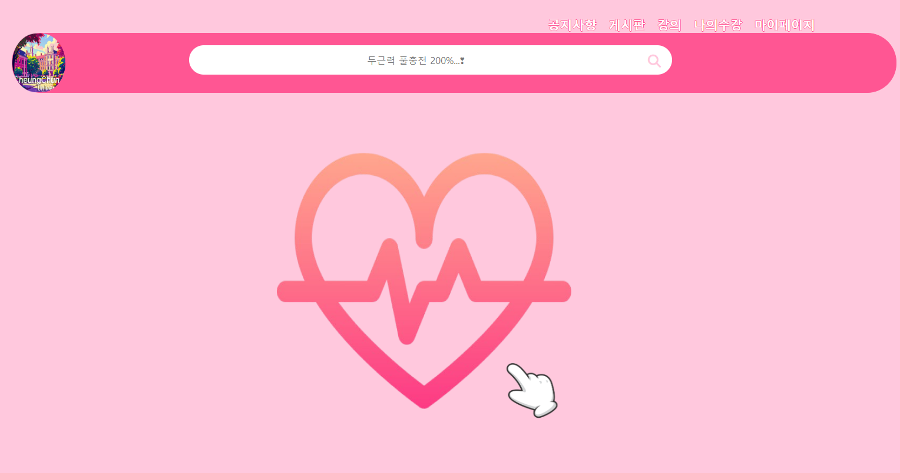
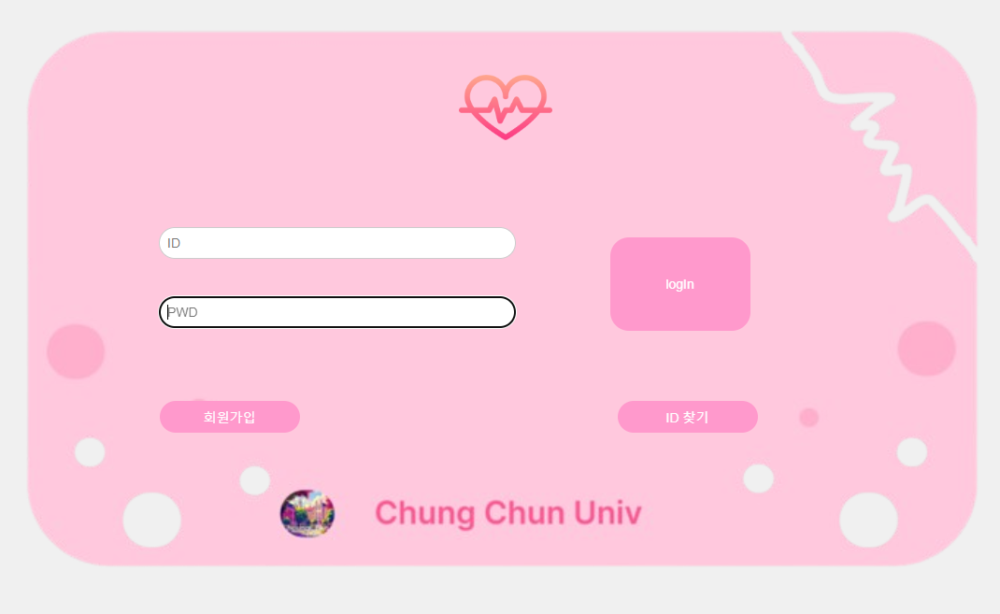
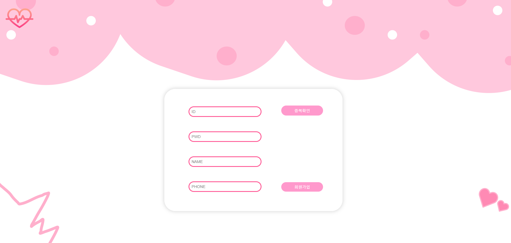
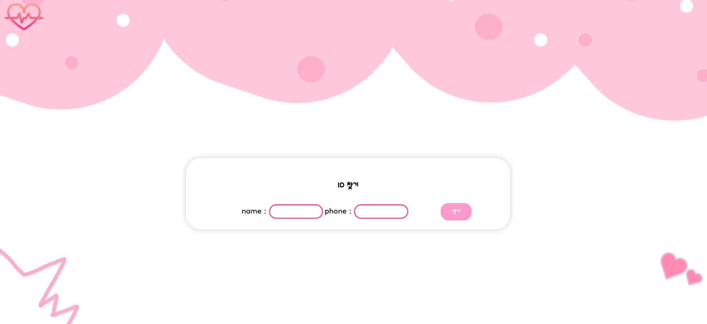
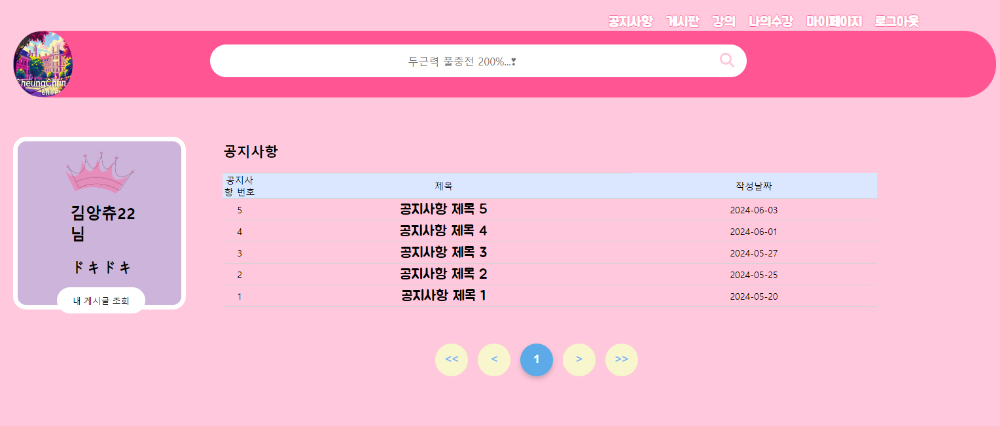
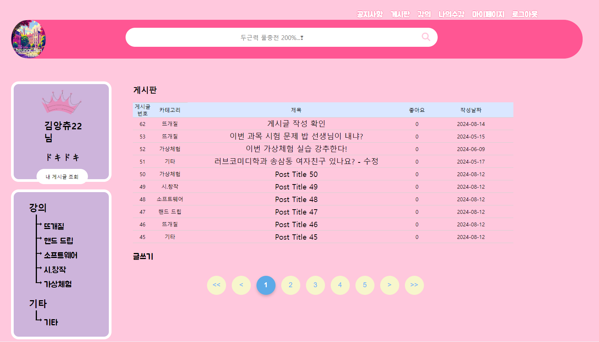
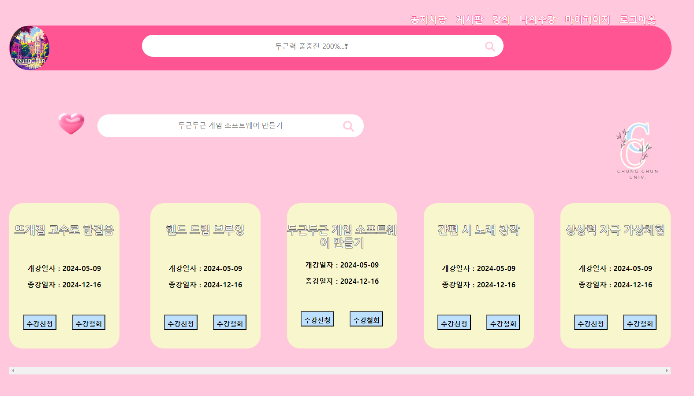
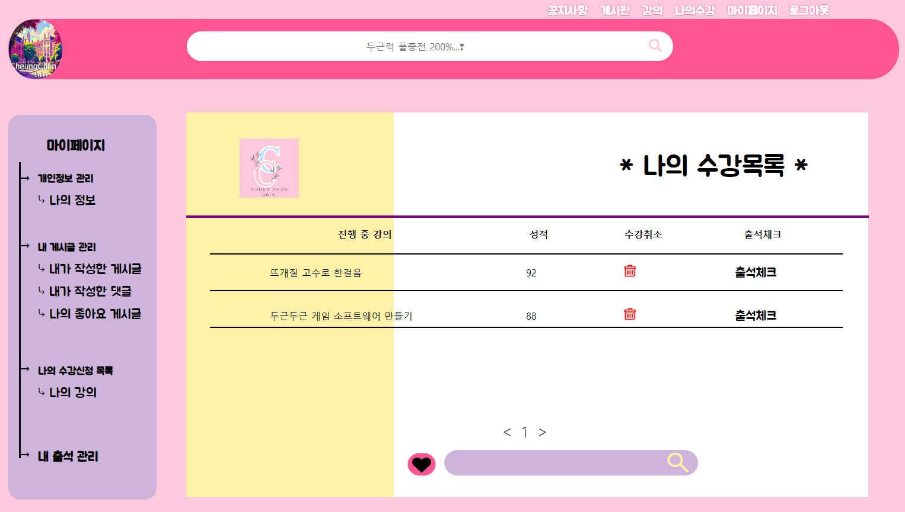
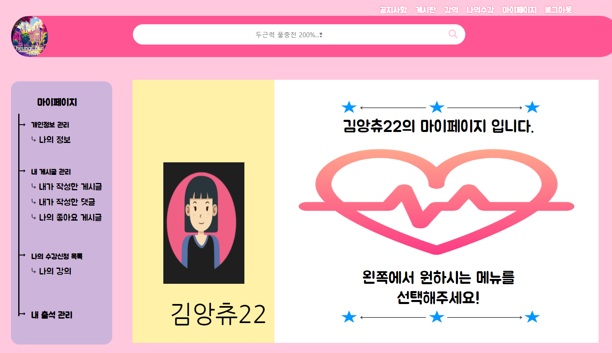

# DoognDoogn

## 💻 `프로젝트 소개`
> 힘든 삶 속에서 대학생으로 회귀한다면?..
> 청춘 남녀들의 잊지 못할
> 대학생 체험기
> 가상 대학생활을 몸소 체험하며 
> 두근두근함을 느끼는
> 우리는 청춘대🎀
> 두근두근
> 청춘❤


`청춘 남녀들의 잊지 못할 대학생 체험기 가상 대학생활을 몸소 체험하며 두근두근함을 느끼는 우리는 청춘대🎀 두근두근 청춘❤`  

##  ⌨️ `개발 기간`


## 🧑‍🤝‍🧑 `멤버구성`
 - 팀원1 : 지동현
 - 팀원2 : 박성은
 - 팀원3 : 배하은
 - 팀원4 : 이의정

## ⚙️ `개발 환경`
   


<br>


## 💻 ...
<a href = "https://github.com/ChungChun-university/DoognDoogn.git">
</a> 


## 📂 `패키지구조(Artifact)` 
```
+---java
|   \---com
|       \---chungchun
|           \---website
|               |   ChungchunUniversityApplication.java
|               |
|               +---auth
|               |   +---controller
|               |   |       AuthController.java
|               |   |
|               |   +---principal
|               |   |       AuthPrincipal.java
|               |   |
|               |   \---service
|               |           AuthService.java
|               |
|               +---comment
|               |   +---controller
|               |   |       CommentController.java
|               |   |
|               |   +---model
|               |   |       Comment.java
|               |   |       CommentDTO.java
|               |   |
|               |   +---repository
|               |   |       CommentRepository.java
|               |   |
|               |   \---service
|               |           CommentService.java
|               |
|               +---common
|               |       ArticlePage.java
|               |       MainController.java
|               |       PagingButtonInfo.java
|               |
|               +---config
|               |       BeanConfiguration.java
|               |
|               +---course
|               |   +---controller
|               |   |       CourseController.java
|               |   |
|               |   +---model
|               |   |       Course.java
|               |   |       CourseDTO.java
|               |   |
|               |   +---repository
|               |   |       CourseRepository.java
|               |   |
|               |   \---service
|               |           CourseService.java
|               |
|               +---likes
|               |   +---controller
|               |   |       LikeController.java
|               |   |       LikeViewController.java
|               |   |
|               |   +---exception
|               |   |       LikeAlreadyExistsException.java
|               |   |       LikeNotFoundException.java
|               |   |
|               |   +---model
|               |   |       Like.java
|               |   |       LikeDTO.java
|               |   |
|               |   +---repository
|               |   |       LikeRepository.java
|               |   |
|               |   +---response
|               |   |       LikeResponse.java
|               |   |
|               |   \---service
|               |           LikeService.java
|               |
|               +---myclass
|               |   +---controller
|               |   |       MyClassController.java
|               |   |
|               |   +---model
|               |   |       MyClass.java
|               |   |       MyClassDTO.java
|               |   |
|               |   +---repository
|               |   |       MyClassRepository.java
|               |   |
|               |   \---service
|               |           MyClassService.java
|               |
|               +---notice
|               |   +---controller
|               |   |       NoticeController.java
|               |   |
|               |   +---model
|               |   |       Notice.java
|               |   |       NoticeDTO.java
|               |   |
|               |   +---repository
|               |   |       NoticeRepository.java
|               |   |
|               |   \---service
|               |           NoticeService.java
|               |
|               +---post
|               |   +---controller
|               |   |       PostController.java
|               |   |
|               |   +---model
|               |   |       Post.java
|               |   |       PostDTO.java
|               |   |
|               |   +---repository
|               |   |       PostRepository.java
|               |   |
|               |   \---service
|               |           PostService.java
|               |
|               +---user
|               |   +---controller
|               |   |       UserController.java
|               |   |       UserSearchRequest.java
|               |   |
|               |   +---model
|               |   |       RoleType.java
|               |   |       User.java
|               |   |       UserDTO.java
|               |   |
|               |   +---repository
|               |   |       UserRepository.java
|               |   |
|               |   \---service
|               |           UserService.java
|               |
|               \---webconfig
|                       CustomAuthenticationSuccessHandler.java
|                       WebSecurityConfig.java
|
\---resources
    |   application.yml
    |
    +---chungchundb
    |       comment.sql
    |       course.sql
    |       data.sql
    |       likes.sql
    |       myclass.sql
    |       notice.sql
    |       post.sql
    |       user.sql
    |
    +---static
    |   |   alert.html
    |   |   alert3.html
    |   |   index.html
    |   |
    |   +---css
    |   |       main.css
    |   |       postDefault.css
    |   |
    |   \---image
    |           bin.png
    |           filledHeart.png
    |           finger.png
    |           h-logo.png
    |           heart.png
    |           loginform.png
    |           logo.png
    |           logo1.png
    |           pink-search.png
    |           pink-wing-left.png
    |           pink-wing-right.png
    |           s-cookie.png
    |           searchPic.PNG
    |           sp-back.png
    |           starline.PNG
    |           user2Image.PNG
    |           수정버튼.png
    |           왕관.png
    |           좋아요.png
    |
    \---templates
        |   main.html
        |
        +---admin
        |       admin.html
        |
        +---auth
        |       login.html
        |
        +---comment
        |       comment.html
        |       createComment.html
        |       myCommentView.html
        |
        +---common
        +---course
        |       courseMain.html
        |
        +---fragments
        |       adminheader.html
        |       header.html
        |       MyPageNav.html
        |       PostNav.html
        |
        +---layout
        |       admindefault.html
        |       default.html
        |       MyPageDefault.html
        |       PostDefault.html
        |
        +---like
        |       my-likes.html
        |
        +---myClass
        |       myClassView.html
        |
        +---myPage
        |       myPage.html
        |
        +---notice
        |       noticeDetails.html
        |       readNotice.html
        |
        +---post
        |       createPost.html
        |       edit.html
        |       myPost.html
        |       postDetails.html
        |       readPost.html
        |
        \---user
                edit.html
                profile.html
                queryId.html
                signUp.html
```

## 📌 주요 기능
###  🖱️ 기능명
- 기능내용

로그인
- 일반사용자와 관리자 ID 로 구분하여 로그인 진행가능

회원가입
- ID, 비밀번호, 이름, 전화번호를 입력하여 회원가입 진행가능

ID 찾기
- 이름, 전화번호를 입력하여 ID 찾기 진행가능

로그아웃
- 로그인된 상태에서 로그아웃 버튼 클릭시 로그아웃 진행가능

공지사항
- 공지사항 목록 조회가능

게시판
- 카테고리별 게시글 조회가능
- 카테고리별 게시글쓰기 진행 가능

강의
- 하트모양 버튼을 클릭하여 내가 신청한 수강목록 조회 화면으로 이동가능


### 📋 게시판관리 
- 

## 🗣️ 후기

>- 지동현 : 기간이 짧았던 만큼 처음에 요구명세서/유스케이스/피그마에서 설계한대로 완전히 반영하지 못했던 아쉬움이 남아있지만 각 도메인 별 엔티티를 정의하고 그에 따른 Controller, Service, Repository 간의 흐름과 로직들을 100퍼센트 가까이 이해했다고 자부할 정도로 많이 배울 수 있었고 뿌듯했습니다. 그리고 HTML부분은 수업과 설계를 병행하면서 진행하다 보니 복습할 시간이 상대적으로 부족했었는데 이번 실습을 통해 스타일을 구성하는 CSS와 타임리프 th: 태그를 써서 기능 구현하는 것 또한 많이 배울 수 있었습니다. 전반적으로 제가 맡은 게시판 페이지에서 게시글 조회, 생성, 수정, 삭제 기능을 HTML 페이지에 연결하였고 페이징 처리 기능 또한 처음에는 로직들을 이해하는데 어려움을 겪었지만 Controller에서 파라미터로 PostDTO가 아닌 Pageable을 썼을 때 어떤식으로 작용이 되는지 부분을 제외하곤 모두 이해하는데 성공하여 개인적으로 만족합니다! <br><br>
결론 : 미완성이지만 프로그래밍 과정속에서 정말 많은 깨달음을 얻었고 수업만으로는 채워지지 않았던 응용 및 변형 욕구를 해소할 수 있어서 너무 즐거웠습니다~!

<br>

>- 박성은 : 처음에 계획했던 것을 다 완성하지 못했다는 것이 가장 아쉽고 내 좋아요 조회에서 하트 아이콘을 눌렀을 시 원래 등록되어 있던 좋아요를 취소하면서 데이터베이스 자체에서도 사라지게 하는 삭제 기능을 넣고 싶었는데 코드를 여러 번 바꾸면서 진행했지만 결국 실패를 하여 기능을 구현하지 못했던 것이 아쉽다. 또한, Id 중복확인도 중복했을 경우 사용할 수 없게 하고 싶었지만 알림창만 뜨고 사용은 할 수 있는 상황이라 프로젝트 이후에도 다시 도전하며 못했던 기능을 성공하고 싶다.  프로젝트 진행 중에 실패한 것들에 이어 관리자 페이지는 메인만 구현이 되어 있는 상태라 관리자 기능도 구현을 해보고 싶다. 전체적으로 이번에 진행하면서 조금 더 코드를 분석하고 이해하는 과정이 부족했던 것 같다. 다음에는 내가 구현한 기능들의 코드들을 자세히 분석해 누군가에게 자연스럽게 설명하고 알려줄 수 있을 정도로 수정하고 사용해야겠다고 생각했다. 팀 프로젝트를 진행하면서 소통의 중요성을 더욱 느꼈고 팀원들간의 소통이 원활하게 이루어져 진행하는 데 큰 어려움은 없었던 것 같다. 처음 시작하기 전과 마지막에 스크럼은 정말 중요한 시간이었고 이를 통해 부족한 부분과 이슈들에 대해 서로 상의하며 앞으로 나아가야 할 방향을 잘 잡은 것 같다고 생각한다. 

<br>

>- 배하은 : 첫 프로젝트인만큼 완성하고 싶다는 생각도 있었지만, 기능을 많이 구현할 수 있을까 하는 걱정도 들었다.
그러나 걱정에 무색하게 모든 팀원들이 열심히 구현하고자 노력하여 만족스러운 결과를 만들어내서 뿌듯했다.
처음 마주한 오류는 나의 수강목록만 조회하는 것인데, 필요로 한 요소가 다른 테이블에 있었고 그 테이블과 묶여있는건 1:M 포린키가 하나뿐이였다.
이 포린키로 묶인 관계들 속에서 내가 원하는 요소만 빼올 수 있을까 고민했던 것을 해결하자 많은 부분에서 진척도가 생겼다.
그 이후로 오류를 맞이했을 때, 왜 오류가 발생하는지 원인과 해결법을 찾아보다보니 스스로도 많은 부분에서 공부가 됐다.
아직 구현하지 못한 기능에 대한 아쉬움도 있지만 그걸 위해서라도 조금 더 정진해야겠다고 생각했다.
팀원들과 분위기가 좋고 다들 열정적으로해서 나도 열정적으로 임하게 됐고, 많은 도전을 한 것 같아서 행복하다.

<br>

>- 이의정 : 사전구상 단계에서 구상한 부분을 실제로 개발 진행시 거의 비슷하게 구현이 되고 있는 부분들이 있어 신기한 경험이었습니다.
html 과 css 를 이용하여 레이아웃 부분을 원하는 대로 만드는 작업도 재미있게 느껴졌습니다.
물론 처음에는 내가 원하는대로 화면이 반영되지 않아 코드 수정하는 작업을 많이 거치긴 했지만 시간을 들여 많은 수정끝에 완성된 모습을 보니 뿌듯함을 느겼습니다.
그러나 java 기능구현 진행시 미약한 부분이 많아 입력하였던 코드들이 작동을 하지 않게되는 부분을 많이 겪었고 계속 진행이 안되어 힘들었지만
팀원분들과 같이 진행을 하다보니 1개씩 기능들이 점점 완성되어 가는 모습을 보며 혼자해서는 절대 하지 못할 일들을 팀원분들과 협동하여 진행하니 훨씬 더 수월하게 진행되는 부분이 있어 많은 점을 배우고 느끼게 되었습니다.
항상 즐거운 팀원분들과 같이 작업을 하였고 비록 완성은 하지 못하였지만 사전구상 단계와 거의 비슷하게 많이 만들어진 부분을 보니 매우 즐거웠습니다.
추후에는 java 부족한 부분들을 복습하여 기능들을 구현할 수 있게 연습하겠습니다. 
힘들었지만 색다른 경험이었고 재미있었습니다!
 

## 두근두근 청춘 대학교 커뮤니티 웹 스크린 구성 및 기능

| **Home** |  **Login**  |  **Register** |
| :---:|:---:|:---:|
|  |  |  |

| **FindUserById** |  **Notification**  |  **Posts** |
| :---:|:---:|:---:|
|  |  |  |

| **Course** |  **MyClass**  |  **MyPage** |
| :---:|:---:|:---:|
|  |  |  |
